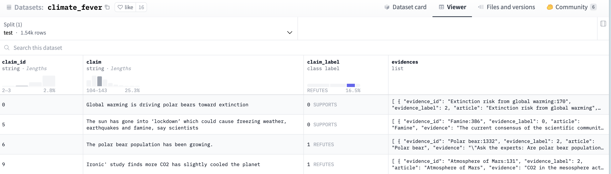
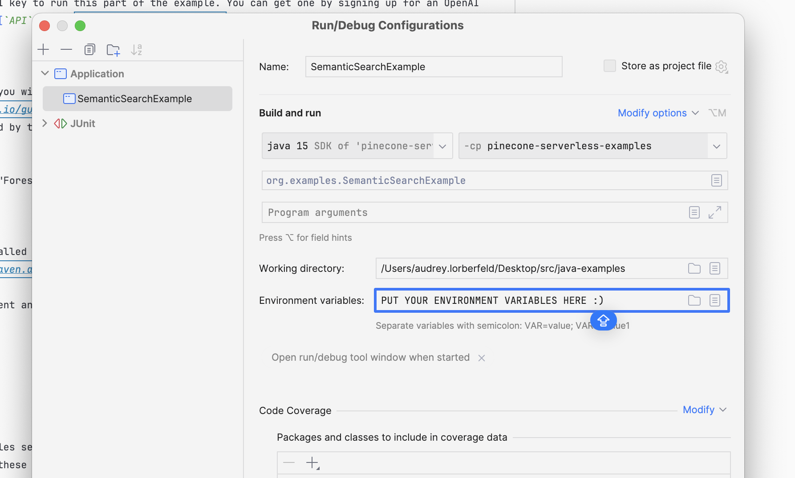

# Semantic Search with Pinecone

This example uses the [Pinecone Java client (beta)](https://docs.pinecone.io/reference/pinecone-clients#java-client)
to build
a [Serverless index for semantic search](https://docs.pinecone.io/reference/architecture/serverless-architecture).

## Overview

In this example, you will grab climate change data from HuggingFace, vectorize it, index it into Pinecone, and
query it to find similar documents.

This example runs start to finish in `SemanticSearchExample.java`. The high level steps are:

- Extract data from HuggingFace
- Vectorize the data with OpenAI
- Store the data in Pinecone
- Vectorize a query with OpenAI
- Execute a semantic search using Pinecone find similar claims to your query

### HuggingFace data

The dataset you will be working with ([`"climate_fever"`](https://huggingface.co/datasets/climate_fever?row=8))
comes from HuggingFace. It contains claims related to climate change that are supported or refuted by a collection of
Wikipedia articles.



### Working with the data

In order to get this data into Pinecone, you will extract the parts you are interested in (`claims`, `articles`, and
`claim labels`) and use OpenAI's [`text-embedding-3-small` model](https://platform.openai.com/docs/guides/embeddings)
to vectorize the text. You will then store the vectors in a
Pinecone [namespace](https://docs.pinecone.io/guides/indexes/using-namespaces) (`test-namespace`), along with
some [metadata](https://docs.pinecone.io/guides/data/filtering-with-metadata).

Note: you will need an OpenAI API key to run this part of the example. You can get one by signing up for an OpenAI
account and navigating to their [`API` page](https://openai.com/product).

### Querying the data

Once the data is in your index, you will issue a query to find the top 5 most similar claims to a given claim (your
"query"),
[filtered](https://docs.pinecone.io/guides/data/filtering-with-metadata) to
only claims that can be supported by the Wikipedia articles. As you did with the data, you will use OpenAI here to embed
your query.

In this example, your query is ""Forest fires make the world hotter," but the example will work with any text query.

## Installation

You will need to have Maven installed to run this example. You can download Maven from
the [official website](https://maven.apache.org/download.cgi). All dependencies are noted in the `pom.xml` file.

To set up a clean maven environment and install this project's dependencies, run the following command in your terminal:

```shell
mvn clean install
```

## Configuration

You will need environment variables set to hold both your Pinecone API key (`PINECONE_API_KEY`) and your OpenAI API key
(`OPENAI_API_KEY`). You can set these in your terminal with the following commands:

```shell
export PINECONE_API_KEY="your-pinecone-api-key"
export OPENAI_API_KEY="your-openai-api-key"
```

If you are running this example in IntelliJ, you can set these environment variables in the run configuration.



## Testing

[FORTHCOMING]
